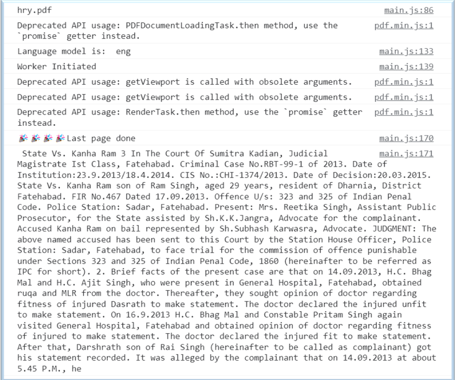

## How to run the project?

> ### npm install

As the project already includes the package and package-lock.json files, so this command will ensure that your local host machine will be having the same version and dependecies installed, so tha can project can run smoothly

> ### node App.js

It will start the backend and now express will handle the request accordingly

> ### localhost:3000

The backend is up and running but in order to intrecat with the project via UI, just type this command into a browser and you will see the beutiful UI pop up in front of you

## What is this project about?

    

    

<b>This is the landing page which acts as the hero section</b>

    

<b>As the project includes transliteration, so the user can test it with any language and the   text will be transliterated into English language. It is giverned by the Google Translate API</b>

    

<b>Steps invloved in the overall functioning of the project</b>

    

<b>This is how the working happens when we just have to extract general information from FIR</b>

    

<b>Console is being populated with every detail & helps the user to track the progress</b>

    

<b>This is the final populated object and the number of key-value pairs varies with  the type of FIR selected</b>

    

<b>A single key: judgement is provided when we tick the Judgement Analysis option</b>

> Final Working video can be found <a href='https://youtu.be/7LPH0cgd9dI'>here</a>
